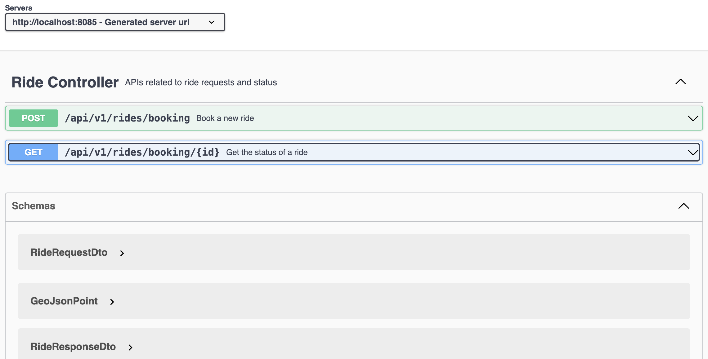
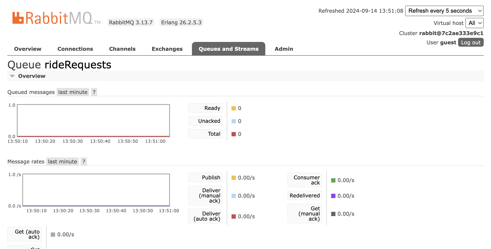
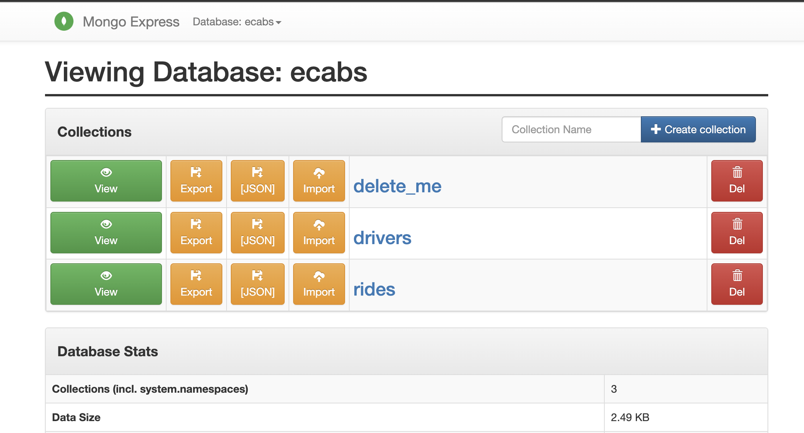

<div align="center">
  <h1>eCabs Technologies</h1>
</div>
<div align="center">
  <strong>Backend Technical Tasks</strong>
</div>
<div align="center">
  A backend system for simulating real world ride requests
</div>


## Overview
This project contains 2 spring boot applications namely;
1. Ride Booking Service
2. Ride Dispatch Service


### Ride Booking Service
This service exposes 2 endpoints. One for requesting a ride and the other for checking the status of the ride.  
A ride is requested by sending a `POST` request to the endpoint `localhost:8085/api/v1/rides/booking`.  

Your request will be published to a RabbitMQ topic/queue to be consumed and processed by the _Ride Dispatch Service_.  

To check the status of your ride, you need to send a `GET` request to `localhost:8085/api/v1/rides/booking/{id}`
More details on this can be found below........


## Ride Dispatch Service
This service consumes the ride request event from the RabbitMQ topic/queue, finds the nearby driver and stores the ride information 
in the MongoDB Rides collection. 


### Key Features
1. Request for a ride
2. Check the status of a Ride


## Key Technologies
1. Spring Boot - app development
2. RabbitMQ - for pub/sub
3. MongoDB - backend database
4. Redis - for caching
5. SwaggerUI - for api documentation


## Prerequisite
To run the application, make sure you have the following installed on your machine.
1. Java JDK 17 or above
2. Latest version of maven 
3. Docker Desktop  


## Starting up the services
Navigate to the root of the ride-booking-service application and run the command below to start the various technologies listed
above as containers within docker

```commandline
docker compose up -d
```

### Starting the Ride Booking Service
Next, run the ride-booking-service application by running the command below;  
```mvn clean install ```
This will remove previously compiled files and build a fresh version of the application


Afterwards, run the command below to start the Ride Booking Service  
```mvn spring-boot:run ``` or hit the run button if you're using intellij.
NB:
The ride booking service should start on the port `8085`


### Starting the Ride Dispatch Service
Navigate to the root directory of the Ride Dispatch Service and execute the command below  
```mvn clean install ```
This will remove previously compiled files and build a fresh version of the application  

Afterwards, run the command below to start the Ride Dispatch Service  
```mvn spring-boot:run ```
or hit the run button if you're using intellij. 


## Booking Request API 

#### Request ride
```
POST http://localhost:8085/api/v1/rides/booking
```

#### Check ride status
```
GET http://localhost:8085/api/v1/rides/booking/{id}
```

## Swagger UI
Alternatively, you can test the application by entering the url below in your browser to launch swagger ui.
```http://localhost:8085/swagger-ui/index.html```  

Once swagger is opened, you can TRY OUT the endpoints like can be seen below;




### RabbitMQ Management
You can access the RabbmitMQ Management page at the address below using `guest` as the default username and password
```http://localhost:15672```  




### Mongo Express
You can view the MongoDB database using mongo-express at the url below using `admin` and `pass` as the default username and password respectively
```http://localhost:8081```  

  


## Support
If you require further instructions contact [Enock Boadi-Ansah](mailto:knocksto1@gmail.com)
